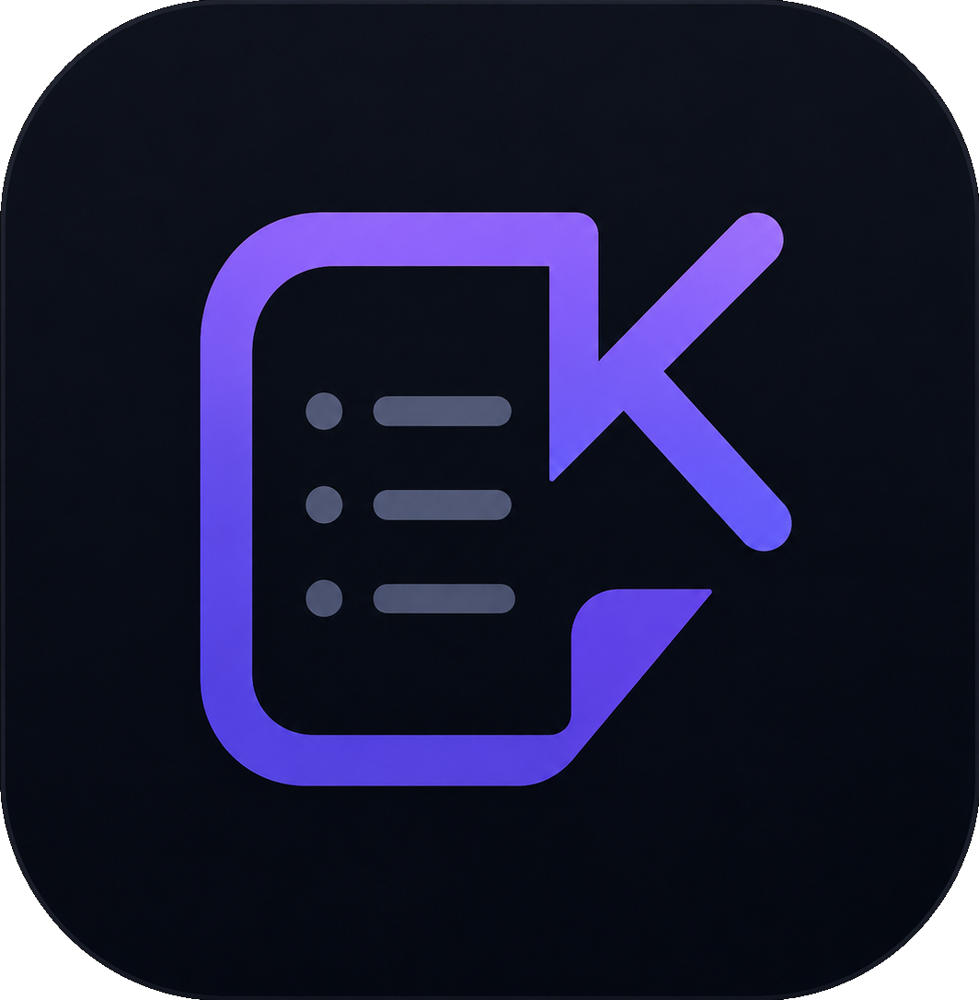

<div align="center">



# KarakeepWidget

**A home-screen widget for [Karakeep](https://karakeep.app) (formerly Hoarder).**

Shows your most recent bookmarks and notes right on your Android home screen,
and taps straight through to the Karakeep app.

</div>

---

## Features

- 📋 **Recent notes at a glance** — fetches your latest bookmarks from your Karakeep instance and lists them as cards.
- 🔄 **Refresh on tap** — a refresh button in the widget header, plus automatic background updates every 30 minutes.
- 🔗 **Tap to open** — tapping a note opens it in the Karakeep app, falling back to the web dashboard if the app isn't installed.
- 🎨 **Material 3 + dynamic color** — built with Jetpack Glance and themed to match your device.
- 🔐 **Self-hosted friendly** — point it at your own Karakeep server with your API key.
- ↔️ **Resizable** — drop it on the home screen and size it to taste.

## Requirements

- **Android 14 (API 34)** or newer.
- A reachable **Karakeep** instance (self-hosted or hosted).
- A **Karakeep API key** (`ak1_…`), created in Karakeep under **Settings → API Keys**.
- _(Optional)_ The official **Karakeep / Hoarder** app installed, for the best tap-through experience.

## Setup

1. Install the app (see [Building](#building) or grab a release APK).
2. Open **KarakeepWidget** from your app drawer.
3. Fill in:
   - **Server URL** — e.g. `https://karakeep.example.com` (no trailing slash needed).
   - **API key** — your `ak1_…` token.
   - **Number of notes** — how many recent items to load (1–100, default 25).
   - **Karakeep app package** — leave as the default `app.hoarder.hoardermobile` unless you run a custom build.
4. Tap **Test connection** to verify, then **Save & refresh widget**.
5. Long-press your home screen → **Widgets** → **Karakeep Notes**, and drop it where you like.

## How it works

The widget reads its configuration from `SharedPreferences` and calls the Karakeep REST API:

```
GET {server}/api/v1/bookmarks?limit={n}&sortOrder=desc
Authorization: Bearer {apiKey}
```

Bookmarks are parsed into a title + snippet per card. Tapping a card launches the Karakeep
app via its launch intent, or opens `{server}/dashboard/preview/{id}` in a browser as a fallback.

## Tech stack

| Area              | Choice                                              |
| ----------------- | --------------------------------------------------- |
| Language          | Kotlin 2.2                                           |
| Widget UI         | [Jetpack Glance](https://developer.android.com/jetpack/androidx/releases/glance) |
| Settings UI       | Jetpack Compose + Material 3                         |
| Networking        | `HttpURLConnection` + `org.json` (no extra deps)    |
| Async             | Kotlin Coroutines                                   |
| Storage           | `SharedPreferences`                                 |
| Build             | Gradle (Kotlin DSL) with a version catalog          |
| Min / Target SDK  | 34 / 36                                              |

## Project structure

```
app/src/main/java/org/spaceelephant/karakeepwidget/
├── data/
│   ├── KarakeepApi.kt    # REST calls + JSON parsing → KarakeepNote
│   └── KarakeepPrefs.kt  # SharedPreferences wrapper (URL, key, limit, app pkg)
├── widget/
│   ├── KarakeepWidget.kt          # Glance UI: header, note list, states
│   ├── Actions.kt                 # Refresh / OpenConfig / OpenNote callbacks
│   └── KarakeepWidgetReceiver.kt  # Glance app-widget receiver
├── ui/theme/             # Compose theme
└── MainActivity.kt       # Settings screen
```

## Building

Requires a recent Android Studio / Android SDK (compileSdk 36).

```bash
# Build a debug APK
./gradlew assembleDebug

# Install onto a connected device
./gradlew installDebug
```

The APK is written to `app/build/outputs/apk/debug/app-debug.apk`.

## Roadmap / ideas

- [ ] Configurable refresh interval.
- [ ] Filter by Karakeep list or tag.
- [ ] Show favicons / thumbnails on cards.
- [ ] Encrypt the stored API key (`EncryptedSharedPreferences`).
- [ ] Unit tests for the bookmark parser.

## License

_No license file yet — add one (e.g. [MIT](https://choosealicense.com/licenses/mit/)) to clarify how others may use this project._

---

<div align="center">
<sub>Not affiliated with the Karakeep project. Karakeep is a trademark of its respective owners.</sub>
</div>
